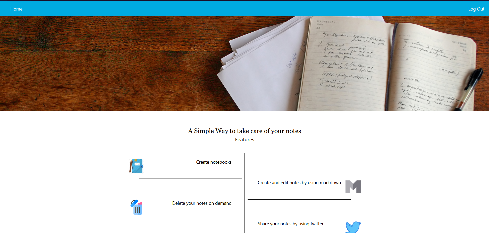
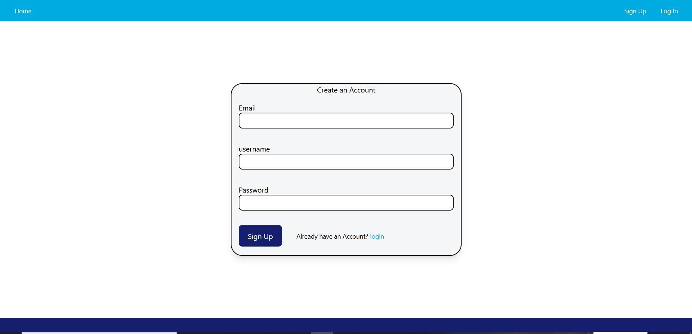
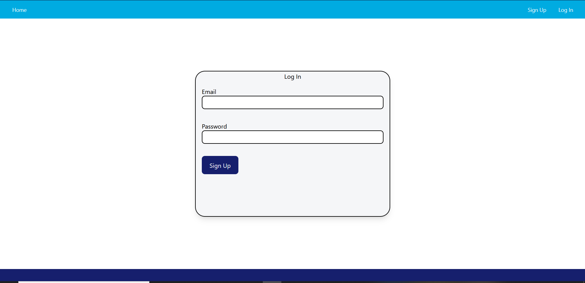
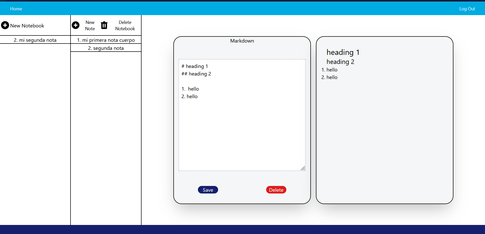

## My Note Taking App 
This app is made to create notebooks and take care of your notes. I did it in order to learn redux, tailwindcss, improve some core concepts of react like hooks and context and learn about github actions CI/CD. 

**you can access the web app by clicking [here](https://alexc957.github.io/My-Note-Taking-App/#/)**

### dependencies

1. tailwindcss@2.1.2.
2. redux/toolkit@1.5.1
3. firebase@8.6.3
4. cypress@7.5.5

### Funcionality
1. create users: signup and login.
2. create notebooks and editing the title by double clicking in the title. 
3. create notes and editing the title by double clicking in the title.
4. There is a section where you can input markdown and other section to render the markdown a show as a preview. 
5. you can either delete or edit notes and notebooks. 

### Screenshots 

#### home 

#### sign Up 

#### login 

#### Main page and notes 

